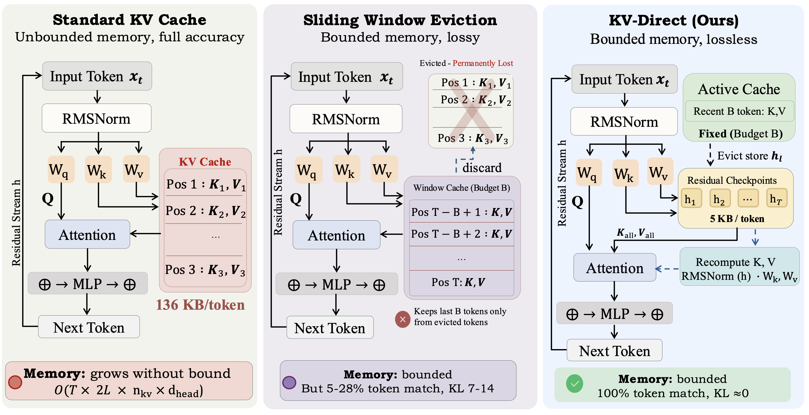

# KV-Direct: Bounded-Memory Transformer Inference via Residual Stream Checkpointing

**The Residual Stream Is All You Need: On the Redundancy of the KV Cache in Transformer Inference**

Kaleem Ullah Qasim, Jiashu Zhang, Muhammad Kafeel Shaheen, Razan Alharith

Southwest Jiaotong University

---

## Abstract

During autoregressive decoding, the key-value (KV) cache stores precomputed keys and values for every past token at every layer, consuming memory that scales linearly with context length. Existing compression methods treat these cached entries as essential state that must be preserved or approximated. We observe that keys and values are deterministic projections of the residual stream: recomputing them from a single residual vector per token yields exactly zero reconstruction error. We verify this identity across six models from four architecture families (135M to 4B parameters) and confirm that decoding without any cache produces token-identical output. Based on this finding, we propose KV-Direct, a bounded-memory inference scheme that replaces evicted KV entries with residual checkpoints and recomputes keys and values on demand. On a 4B-parameter model, one residual checkpoint costs 5 KB per token versus 136 KB for the full KV pair, a 27x reduction. Over 20 conversation turns, KV-Direct bounds peak memory to 42 MB while the standard cache grows past 103 MB. Compared with five eviction baselines, KV-Direct preserves 100% token match at every cache budget; all baselines degrade to 5-28%. Recomputation from checkpoints runs up to 5x faster than reading cached tensors at moderate batch sizes, showing that the assumed computation-memory tradeoff can be inverted.

## Method

  

**Three inference regimes compared.** *(Left)* Standard KV cache: stores all K/V pairs, memory grows as O(T) with sequence length. *(Centre)* Sliding window eviction: bounds memory to the last B tokens but permanently discards evicted KV entries. *(Right)* KV-Direct: evicted KV entries are replaced by residual stream checkpoints (5 KB/token for a 4B model), from which exact K and V are recomputed on the fly, achieving bounded memory with 100% token match.

## Code

Code and experimental scripts are coming soon. Stay tuned.
